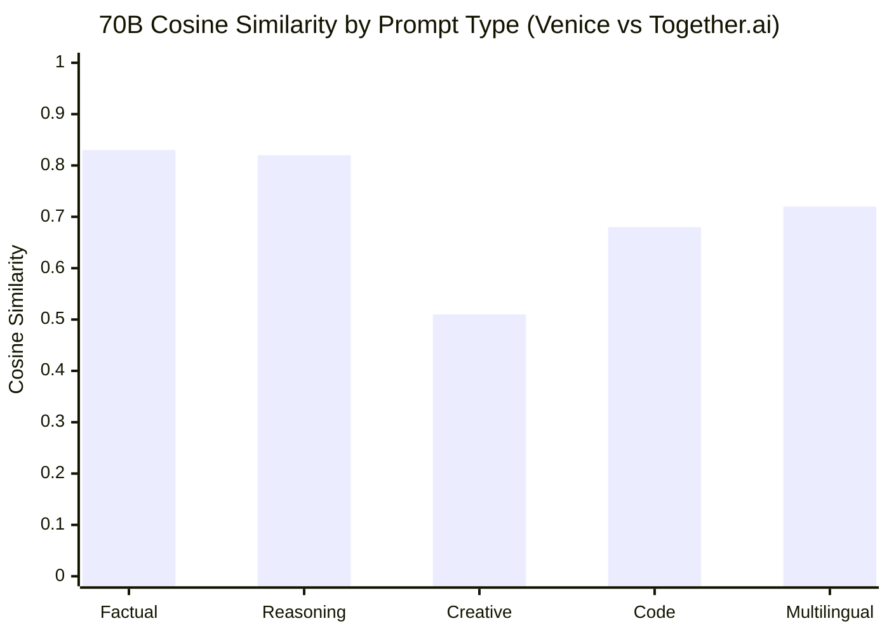
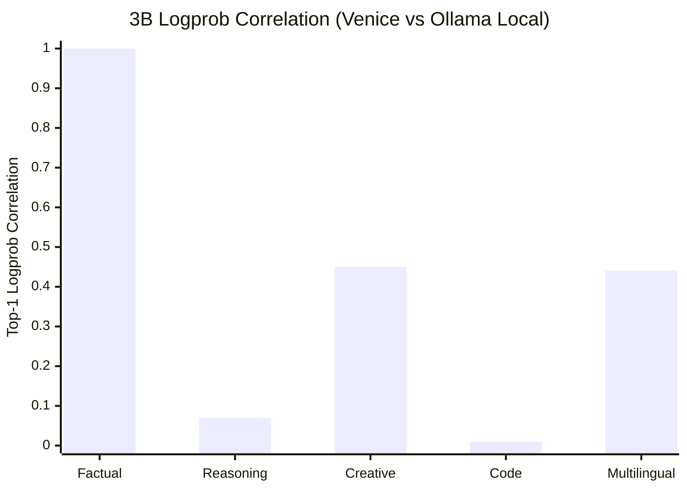

# VerifyVenice

**Open-source spot-check of Venice.ai's inference claims, with cryptographically verifiable computations powered by ICME Labs' [JOLT-Atlas](https://github.com/ICME-Lab/jolt-atlas) zero-knowledge machine learning.**

Venice.ai markets itself as an "uncensored" AI platform running open-source models. This project tests two claims:

1. **Model Authenticity** — Is Venice actually running the models they say they are (e.g. Llama 3.3 70B)?
2. **System Prompt Transparency** — Does their "uncensored" toggle actually do anything?

We compare Venice's API responses against reference providers (Together.ai for 70B, local Ollama for 3B ground truth), then generate **zero-knowledge proofs** (JOLT-Atlas zkML) so anyone can verify the computations weren't fabricated.

> **Caveats**: This is a point-in-time spot-check (March 2026) with 50 prompts per test group — not an audit. Venice's 70B model does not support logprobs, so the 70B result relies on text similarity metrics only — weaker evidence than logprob-based verification. The 3B verification is much stronger.

---

## Results

### 70B: Text similarity is consistent with the claimed model



**Mean cosine similarity: 0.71** across 50 test pairs (Venice 70B vs Together.ai 70B). Factual and reasoning prompts show strong agreement (~0.82). Creative prompts diverge more (0.51), which is expected — creative tasks are inherently variable even on the same model.

Venice 70B was classified as **"70b-class" with 67.7% confidence** using a text-based classifier. Suggestive, not conclusive — text similarity alone is weak evidence.

### 3B Model: Strong Logprob Verification



For the 3B model (which supports logprobs), factual prompts show **0.999 logprob correlation** — strongly correlated probability distributions. The logprob-based classifier achieved **100% accuracy** at distinguishing 3B from 70B responses, while the text-only classifier scored 50% (random chance).

This suggests **logprobs are far more reliable** for model verification. Text features alone can't reliably fingerprint a model.

### Classifier Performance

| Classifier | Accuracy | Features | Verdict |
|---|---|---|---|
| Logprob-based | **100%** | 4 logprob features | Reliably distinguishes 3B vs 70B in our sample |
| Text-based | **50%** | 6 text features | Random chance — text alone is insufficient |

### The "Uncensored" Toggle Measurably Changes Behavior

```mermaid
xychart-beta
    title "Response Length: WITH vs WITHOUT Venice System Prompt"
    x-axis ["Factual", "Reasoning", "Creative", "Code", "Multilingual"]
    y-axis "Avg Response Length (chars)" 0 --> 1200
    bar [31, 455, 69, 1089, 256]
    bar [409, 475, 72, 1115, 336]
```



We sent 15 prompts with and without Venice's `include_venice_system_prompt` toggle.

- **0/15 identical responses** — the toggle genuinely changes behavior
- Factual answers are **13x shorter** with the system prompt (31 vs 409 chars)
- Code and reasoning prompts barely affected (length ratio ~0.96)
- Mean cosine similarity between with/without: **0.76**

The toggle is not cosmetic. When enabled, Venice prepends a system prompt that measurably alters model behavior, particularly for short factual queries.

### System Prompt Effect by Category

| Prompt Type | Cosine Sim | Length WITH | Length WITHOUT | Ratio |
|---|---|---|---|---|
| Factual | 0.38 | 31 | 409 | 0.08x |
| Reasoning | 0.84 | 455 | 475 | 0.96x |
| Creative | 0.78 | 69 | 72 | 0.96x |
| Code | 0.96 | 1089 | 1115 | 0.98x |
| Multilingual | 0.82 | 256 | 336 | 0.76x |

---

## zkML Proofs (JOLT-Atlas)

Both computations are backed by zero-knowledge proofs using [JOLT-Atlas](https://github.com/ICME-Lab/jolt-atlas):

| Circuit | What it verifies | Proof Size | Prove Time |
|---|---|---|---|
| Output Comparison | Similarity score was computed correctly | 24.5 KB | 0.73s |
| Model Fingerprint | Classifier was run correctly on features | 24.4 KB | 0.73s |

The proofs use **HyperKZG over BN254** with Blake2b transcripts. Anyone with the ONNX model and proof file can independently verify the computations were performed correctly. Note: the proofs verify the math, not that the inputs came from Venice's API — data provenance is a separate problem.

```bash
cd rust
cargo run --release --example prove_fingerprint -- \
  --input ../data/proofs/fingerprint_input.json \
  --model models/model_fingerprint.onnx
```

---

## Methodology

### Test Groups

| Group | Purpose | Samples | Venice Model | Reference |
|---|---|---|---|---|
| **A** (Output Integrity) | Compare responses across providers | 50 pairs | 70B + 3B | Together.ai 70B, Ollama 3B |
| **B** (Model Authenticity) | Classify model size from features | 50 per provider | 70B + 3B | Together.ai 70B, Ollama 3B |
| **System Prompt** | Test toggle effect | 15 pairs | 70B | Same model, toggle on/off |
| **Calibration** | Establish baselines | 100 runs | Local 3B | Local 3B (self-comparison) |

### Prompt Categories

Each test uses 10 prompts across 5 categories: **factual**, **reasoning**, **creative**, **code**, and **multilingual**.

### Comparison Modes

Venice's API has logprob limitations that required a multi-mode approach:

| Provider | Logprob Support | Comparison Mode |
|---|---|---|
| Venice 70B (`llama-3.3-70b`) | None | Text-only (cosine, jaccard, BLEU, edit distance) |
| Venice 3B (`llama-3.2-3b`) | Top-1 per token (no top-k) | Top-1 logprob correlation |
| Together.ai 70B | Full (top-5) | Full logprob comparison |
| Ollama 3B (local) | Full (top-5) | Full logprob comparison |

### Calibration Baseline

100 local Ollama runs established the ground truth:
- Intra-model KL divergence mean: **0.105** (950 pairs)
- Token agreement: **99.5%** (same model, same prompt, different seeds)

---

## Architecture

```
verifyvenice/
├── python/                 # Data collection & analysis pipeline
│   ├── src/
│   │   ├── clients/        # Venice, Together.ai, Ollama API clients
│   │   ├── collectors/     # Output integrity & model authenticity collectors
│   │   ├── analysis/       # Fingerprinting, similarity, statistical analysis
│   │   └── report/         # Report generator
│   └── scripts/            # run_collection.py, run_analysis.py, run_report.py
├── rust/                   # zkML proof circuits
│   ├── circuits-common/    # Shared types (ProofArtifact, fixed-point conversion)
│   ├── output-comparison/  # Circuit 1: similarity computation proof
│   ├── model-fingerprint/  # Circuit 2: classifier execution proof
│   └── models/             # ONNX models for proof generation
├── data/
│   ├── processed/          # Analysis results (JSON)
│   └── proofs/             # Generated proof artifacts
└── reports/                # Generated markdown reports
```

## Limitations

1. **Venice 70B has no logprob support** — text-based verification is fundamentally weaker than logprob-based. The 67.7% classification confidence is above chance but not definitive.
2. **Point-in-time snapshot** — Venice could change infrastructure at any time.
3. **50 prompts per group** — larger sample sizes would improve statistical power.
4. **Text classifier at random chance (50%)** — text features alone cannot distinguish model sizes. This is a known limitation, not a bug.
5. **zkML proofs verify computation, not data provenance** — the proofs attest that the similarity/classification was computed correctly on the given inputs, but don't prove the inputs came from Venice's API. This is an open research problem.

## Roadmap

- **Larger samples** — scale from 50 to 500+ prompts per group for stronger statistical power
- **Longitudinal monitoring** — re-run weekly to detect infrastructure changes over time
- **Data provenance via TLSNotary** — cryptographically prove API responses actually came from Venice's servers, closing the biggest gap in the current zkML story
- **More providers** — apply the same methodology to other OpenAI-compatible APIs (Groq, Fireworks, etc.) to make the framework provider-agnostic
- **Additional model sizes** — test 8B, 13B, and other sizes as providers add them, to stress-test the classifier across a wider range

## Running It Yourself

### Prerequisites

- Python 3.11+ with `openai`, `numpy`, `scikit-learn`, `torch`
- Rust 1.88+ with `riscv32im-unknown-none-elf` target (for JOLT-Atlas)
- API keys for Venice.ai and Together.ai
- Ollama running locally with `llama3.2:3b`

### Collection

```bash
cp .env.example .env  # Add your API keys
cd python
python scripts/run_collection.py
python scripts/run_analysis.py
python scripts/run_report.py
```

### Proof Generation

```bash
cd rust
cargo run --release --example prove_fingerprint -- \
  --input test_fingerprint_input.json \
  --model models/model_fingerprint.onnx \
  --output-dir ../data/proofs
```

## License

MIT
